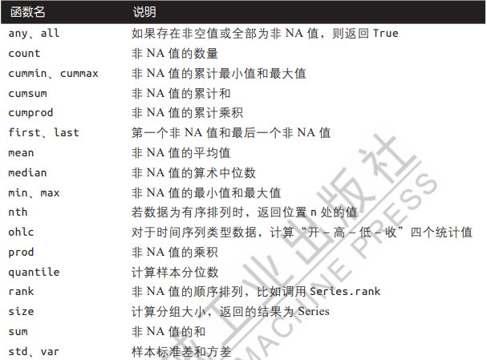

# GroupBy机制

`groupby`函数

[pandas.DataFrame.groupby — pandas 2.0.3 documentation (pydata.org)](https://pandas.pydata.org/docs/reference/api/pandas.DataFrame.groupby.html?highlight=groupby#pandas.DataFrame.groupby)

1. 函数参数

```python
DataFrame.groupby(by=None, axis=0, level=None, as_index=True, sort=True, group_keys=True, observed=False, dropna=True)
```

- `by`用于确定分组的依据，可以是与需要分组的轴向长度一致的值列表或数组；DataFrame的列名的值；可以将分组轴向上的值和分组名称相匹配的字典或Series；可以在轴索引或索引中的单个标签上调用的函数
- `axis`沿行/列进行分组，0为行，1为列，默认为0
- `level`根据层级进行分组时，指定特定的层级
- `as_index`默认为真，则以原来group的标签作为索引；若为假，则以"SQL-style"分组输出
- `sort`默认为真，对组建进行排序
- `group_keys`默认为真，若为假，则不显示得到对象根据分组键形成的分层索引以及每个原始对象的索引
- `observed`默认为假，显示分类grouper的所有值；若为真，则显示分类的grouper的观测值
- `dropna`默认为真，删除含有NA值的行或列；若为假，则将NA值视为组中的键

## 对分组进行迭代

1. groupby返回的对象支持迭代，可以产生一个二元组构成的序列，每个元组包含分组名与数据块

## 选取一列或多列

1. 使用单个列名或列名数组对由DataFrame创建的GroupBy对象建立索引

## 利用字典和Series进行分组

1. 分组信息能以字典和Series形式存在，可以根据其他分组信息进行分组

## 利用函数进行分组

1. groupby能够接收python函数

## 根据索引层级分组

1. 通过 `level`参数可以对轴索引的某个层级进行聚合

# 数据聚合

经过优化的groupby方法



## 逐列操作和多函数应用

### 聚合函数：`aggregate`函数

[pandas.DataFrame.aggregate — pandas 2.0.3 documentation (pydata.org)](https://pandas.pydata.org/docs/reference/api/pandas.DataFrame.aggregate.html?highlight=aggregate#pandas.DataFrame.aggregate)

1. 函数参数

```python
DataFrame.aggregate(func=None, axis=0, *args, **kwargs)
```

- `func`用于聚合的函数，可以函数，函数名称字符串，函数列表或者函数名称列表，含有列名与函数对应关系的字典
- `axis`默认为0，0则将函数应用于每行，1则将函数应用于每列
- `*args`要传递给函数的位置参数
- `**kwargs`要传递给函数的关键字参数

## 返回不含行索引的聚合数据

1. 要返回不含行索引的聚合数据，可以向groupby传递 `as_index=False`来禁用分组键作为索引的行为

# Apply：通用的拆分-应用-联合

`apply`函数

[pandas.DataFrame.apply — pandas 2.0.3 documentation (pydata.org)](https://pandas.pydata.org/docs/reference/api/pandas.DataFrame.apply.html?highlight=apply#pandas.DataFrame.apply)

1. 函数参数

```python
DataFrame.apply(func, axis=0, raw=False, result_type=None, args=(), **kwargs)
```

- `func`应用于每一行或每一列的函数
- `axis`应用函数的轴，默认为0，0为行，1为列
- `raw`确定行或列时作为Series对象还是ndarray对象传递，默认为假，将每一行或每一列作为Seies传递给函数；若为真，传递的函数将接收ndarray对象
- `result_type`仅在以下情况下起作用，axis=1; 'expand':类似列表的结果将变成列;'reduce':如果可能的话返回一个Series，而不是展开类似列表的结果; 'broadcast':结果将会被广播道原始形状的DataFrame,原来的index和columns将会被保留。默认为'None'
- `args`将位置参数传递给 `func`，除了array/series
- `**kwargs`要作为关键字参数传递给 func 的其他关键字参数

## 禁用分组键

1. 得到的对象具有分组键所形成的分层索引以及每个原始对象的索引，可以通过向 `groupby`传递 `group_keys=False`来禁用这个功能

## 分位数和桶分析

1. `cut`返回的Categorical对象可以直接传递给groupby，根据样本分位数计算出等长桶
2. `qcut`，根据样本分位数计算出等大小的桶
3. 可以传递 `labels=False`来获得分位数数值

## 示例：用指定分组的值填充缺失值

1. `dropna`来去除缺失值
2. `fillna`使用其他数值来填充NA值

## 示例：随机采样和排列

`sample`函数

[pandas.DataFrame.sample — pandas 2.0.3 documentation (pydata.org)](https://pandas.pydata.org/docs/reference/api/pandas.DataFrame.sample.html?highlight=sample#pandas.DataFrame.sample)

1. 函数参数

```python
DataFrame.sample(n=None, frac=None, replace=False, weights=None, random_state=None, axis=None, ignore_index=False)
```

- `n`从轴返回的项目数，不能与 `frac`一起使用，如果 `frac=None`则 `n`为1

- `frac`要返回的轴项的分数，不能与 `n`一起使用

- `replace`允许或禁止多次对同一行进行采样，默认为假

- `weights`默认值“无”会导致相同的概率权重

- `random_state`如果是 int、数组类或位生成器，则为随机数生成器提供种子

- `axis`需要sample的轴，默认为None，0为行，1为列

- `ignoe_index`默认为假，若为真，则生成的索引将标记为 0， 1， ...， n - 1

## 示例：分组加权和相关系数

## 示例：分组线性回归

# 分组转换和展开式GroupBy运算

`transform`函数

[pandas.DataFrame.transform — pandas 2.0.3 documentation (pydata.org)](https://pandas.pydata.org/docs/reference/api/pandas.DataFrame.transform.html?highlight=transform#pandas.DataFrame.transform)

1. 函数参数

```python
DataFrame.transform(func, axis=0, *args, **kwargs)
```

- `func`可以接受函数，函数名称字符串，函数列表或函数名称，轴标签与函数对应形成的字典
- `axis`默认为0，则将函数应用于每行；若为1，则将函数应用于每列
- `*args`要传递给函数的位置参数
- `**kwargs`要传递给函数的关键字参数

2. 与 `apply`函数的区别，对能使用的函数有更多的限制

- 生成标量值，能传播到分组形状
- 生成与输入分组具有相同形状的对象
- 无法修改输入

# 透视表和交叉表

### `pivot_table`函数

[pandas.DataFrame.pivot_table — pandas 2.0.3 documentation (pydata.org)](https://pandas.pydata.org/docs/reference/api/pandas.DataFrame.pivot_table.html?highlight=pivot_table#pandas.DataFrame.pivot_table)

1. 函数参数

```python
DataFrame.pivot_table(values=None, index=None, columns=None, aggfunc='mean', fill_value=None, margins=False, dropna=True, margins_name='All', observed=False, sort=True)
```

- `values`要聚合的列
- `index`在结果透视表的行上进行分组的列名或其他分组键
- `columns`在结果透视表的列上进行分组的列名和其他分组键
- `aggfunc`聚合函数或函数列表，默认情况下是 `mean`
- `fill_value`在结果表中替换缺失值的值
- `margins`添加行/列小计和总计，默认为False
- `dropna`如果为真，将不含所有条目均为NA的列
- `margins_name`将包含总计的行/列的名称,默认为ALL
- `observed`若为真，仅显示分组键中的观测值；为假，则显示所有值
- `sort`是否对结果进行排序

### `crosstab`函数

[pandas.crosstab — pandas 2.0.3 documentation (pydata.org)](https://pandas.pydata.org/docs/reference/api/pandas.crosstab.html?highlight=crosstab#pandas.crosstab)

1. 函数参数

```python
pandas.crosstab(index, columns, values=None, rownames=None, colnames=None, aggfunc=None, margins=False, margins_name='All', dropna=True, normalize=False)
```

- `index`行中要作为分组依据的值

- `columns`列中要作为分组依据的值

- `values`聚合数组值的依据，需要指定 `aggfunc`

- `rownames`默认为无，如果传递，则必须与传递的行数组数匹配

- `colnames`默认为无，如果传递，则必须与传递的列数组数匹配

- `aggfunc`如果指定，则 `values`也需指定

- `margins`添加行/列小计和总计，默认为False

- `margins_name`将包含总计的行/列的名称,默认为ALL

- `dropna`如果为真，将不含所有条目均为NA的列

- `normalize`默认为假，如果传递'all'或 True，则将对所有值进行规范化；如果传递'index'将在每一行上规范化；如果传递'columns'，则会在每列上规范化；如果边距为 True，则还将规范化边距值
