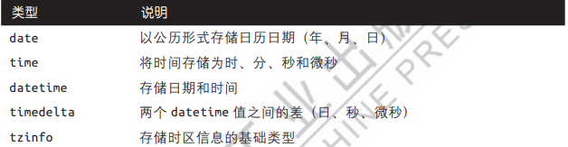
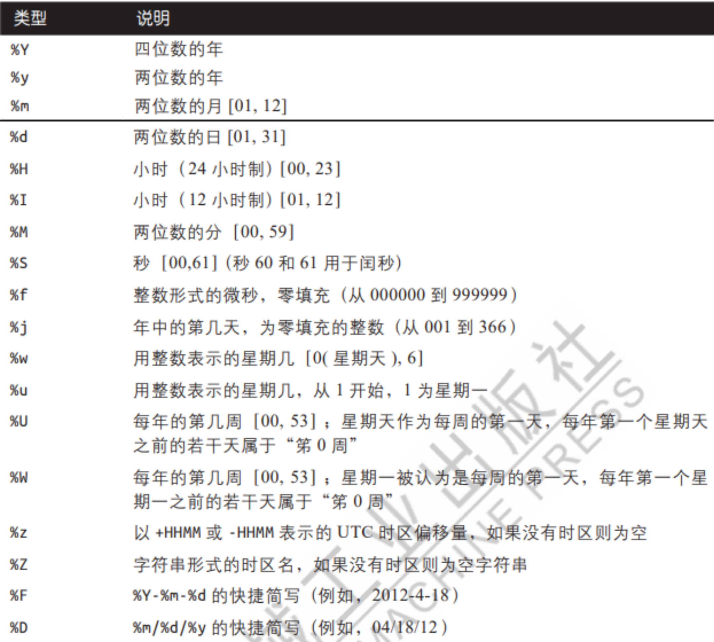
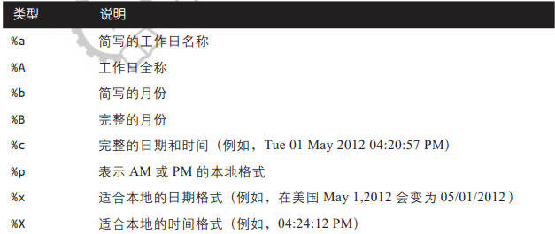
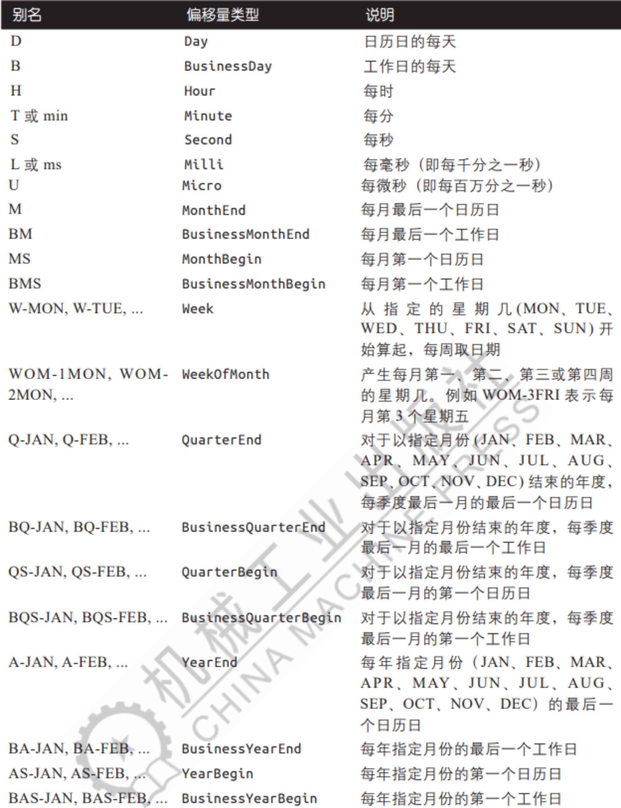

# 日期和时间数据的类型及工具

1. `datetime`模块中的数据类型



2. 字符串与 `datetime`的相互转换

`strftime`函数

[pandas.Timestamp.strftime — pandas 2.0.3 documentation (pydata.org)](https://pandas.pydata.org/docs/reference/api/pandas.Timestamp.strftime.html?highlight=strftime#pandas.Timestamp.strftime)

- 函数参数

```python
Timestamp.strftime(format)
```

- 可以指定转换的格式，下图为datetime的格式说明



- datetime对象还有一些本地化格式选项



# 时间序列基础知识

1. pandas最基本的时间序列类型就是以时间戳为索引的Series
2. `pandas.TimeStamp`可以随时自动转换为 `datetime`对象

## 索引、选取、子集构造

### `date_range`函数

[pandas.date_range — pandas 2.0.3 documentation (pydata.org)](https://pandas.pydata.org/docs/reference/api/pandas.date_range.html?highlight=date_range#pandas.date_range)

1. 函数参数

```python
pandas.date_range(start=None, end=None, periods=None, freq=None, tz=None, normalize=False, name=None, inclusive='both', *, unit=None, **kwargs)
```

- `start`生成日期的左边界
- `end`生成日期的右边界
- `periods`要生成的周期数
- `freq`时间序列频率
- `tz`用于返回本地化日期时间索引的时区名称
- `normalize`在生成日期范围之前，将开始/结束日期规范化为午夜
- `name`生成的日期时间索引的名称
- `inclusive`包括边界;是将每个边界设置为封闭还是开放，{“both”, “neither”, “left”, “right”}, 默认为“both”
- `unit`指定所需的结果分辨率
- `**kwargs`为了兼容性。对结果没有影响

### `truncate`函数

[pandas.DataFrame.truncate — pandas 2.0.3 documentation (pydata.org)](https://pandas.pydata.org/docs/reference/api/pandas.DataFrame.truncate.html?highlight=truncate#pandas.DataFrame.truncate)

1. 函数参数

```python
DataFrame.truncate(before=None, after=None, axis=None, copy=None)
```

- `before`截断此索引值之前的所有行
- `after`截断此索引值之后的所有行
- `axis`要截断的轴,默认为0/行，1为列
- `copy`返回截断的的副本

## 带有重复索引的时间序列

1. 可以用 `is_unique`来判断索引是否唯一

# 日期的范围、频率以及位移

## 生成日期范围

1. 基本的时间序列频率

   

## 频率和日期偏移量

## 对超前和滞后数据进行移位

### `shift`函数

[pandas.DataFrame.shift — pandas 2.0.3 documentation (pydata.org)](https://pandas.pydata.org/docs/reference/api/pandas.DataFrame.shift.html?highlight=shift#pandas.DataFrame.shift)

1. 函数参数

```python
DataFrame.shift(periods=1, freq=None, axis=0, fill_value=_NoDefault.no_default)
```

- `periods`要移位的周期数。可以是正数，也可以是负数
- `freq`移位使用的周期
- `axis`移位的轴向，0/行，1/列，默认为0
- `fill_value`用于新引入的缺失值的标量值

# 时区处理

## 时区本地化和转换

### `tz_localize`函数

[pandas.DatetimeIndex.tz_localize — pandas 2.0.3 documentation (pydata.org)](https://pandas.pydata.org/docs/reference/api/pandas.DatetimeIndex.tz_localize.html?highlight=tz_localize#pandas.DatetimeIndex.tz_localize)

1. 函数参数

```python
DatetimeIndex.tz_localize(tz, ambiguous='raise', nonexistent='raise')
```

- `tz`要将时间戳转换为的时区
- `ambiguous`当时钟因夏令时而向后移动时，可能会出现时间不明确的情况
- `nonexistent`一个不存在的时间不会存在于一个特定的时区

### `tz_convert`函数

[pandas.DatetimeIndex.tz_convert — pandas 2.0.3 documentation (pydata.org)](https://pandas.pydata.org/docs/reference/api/pandas.DatetimeIndex.tz_convert.html?highlight=tz_convert#pandas.DatetimeIndex.tz_convert)

1. 函数参数

```python
DatetimeIndex.tz_convert(tz)
```

- 将一个已经被本地化为某个特定的时区的时间序列转换为另一个时区

## 对时区型时间戳对象的操作

## 不同时区之间的运算

# 周期及其算术运算

## 周期的频率转换

### `asfreq`函数

[pandas.PeriodIndex.asfreq — pandas 2.0.3 documentation (pydata.org)](https://pandas.pydata.org/docs/reference/api/pandas.PeriodIndex.asfreq.html?highlight=asfreq#pandas.PeriodIndex.asfreq)

1. 函数参数

```python
PeriodIndex.asfreq(freq=None, how='E')
```

- `freq`转换的频率

- `how`元素是否应与末尾对齐 或在PA期内开始，“E”表示结束；“S”表示开始。默认为"S"

## 季度周期频率

## 时间戳和周期的相互转换

### `to_period`函数

[pandas.Timestamp.to_period — pandas 2.0.3 documentation (pydata.org)](https://pandas.pydata.org/docs/reference/api/pandas.Timestamp.to_period.html?highlight=to_period#pandas.Timestamp.to_period)

1. 函数参数

```python
Timestamp.to_period()
```

- 将时间戳转换为区间

### `to_timestamp`函数

[pandas.Period.to_timestamp — pandas 2.0.3 documentation (pydata.org)](https://pandas.pydata.org/docs/reference/api/pandas.Period.to_timestamp.html?highlight=to_timestamp#pandas.Period.to_timestamp)

1. 函数参数

```python
Period.to_timestamp()
```

- 将区间转换成时间戳

## 通过数组创建PeriodIndex

# 重采样及频率转换

`resample`函数

[pandas.DataFrame.resample — pandas 2.0.3 documentation (pydata.org)](https://pandas.pydata.org/docs/reference/api/pandas.DataFrame.resample.html?highlight=resample#pandas.DataFrame.resample)

1. 函数参数

```python
DataFrame.resample(rule, axis=0, closed=None, label=None, convention='start', kind=None, on=None, level=None, origin='start_day', offset=None, group_keys=False)
```

- `rule`表示目标转换的偏移字符串或对象
- `axis`用于上采样或下采样的轴,0/行，1/列，默认为0
- `closed`向下采样中，每段间隔的哪一段是封闭的，“right”或“left”
- `label`向下采样中，如何用“right”或“left”的箱标签标记聚合结果
- `convention`在对区间重新采样时，用于将低频周期转换为高频的约定{'start' or 'end'}，默认为'end'
- `kind`对区间或时间戳的聚合；默认为时间序列索引的类型
- `on`对于数据帧，使用列而不是索引进行重新采样。 列必须类似于日期时间
- `level`对于多索引，用于的级别（名称或数字） 重新采样。级别必须类似于日期时间
- `origin`用于调整分组的时间戳
- `offset`对箱标签进行时间调校
- `group_keys`在采样的对象上使用时是否在结果索引中包含组键
- `fill_method`向上采样时的插值方式，'ffill' or 'bfill'，默认不插值

## 降采样

需要考虑两件事

1. 各区间哪边是闭合的
2. 如何对各个聚合分箱打标签，是用区间的开头还是末尾

## 升采样和插值

1. 升采样不需要任何聚合
2. `ffill`为向上插值；`bfill`为向下插值

## 使用周期进行重采样

区间涉及时间范围，因此

1. 向下采样中，目标频率必须是原频率的子区间
2. 向上采样中，目标频率必须是原频率的父区间

## 对分组时间进行重采样

# 移动窗口函数

## 指数加权函数

## 二元移动窗口函数

## 用户自定义的移动窗口函数
