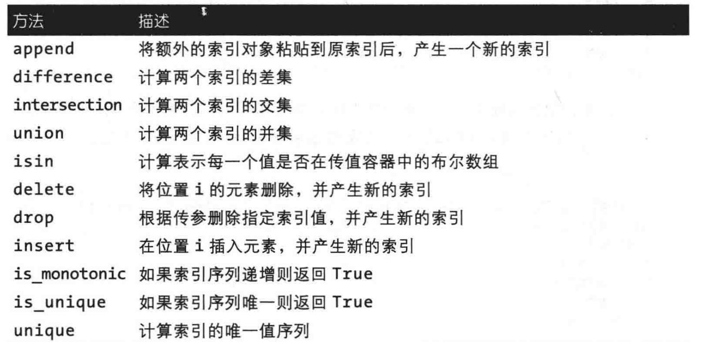
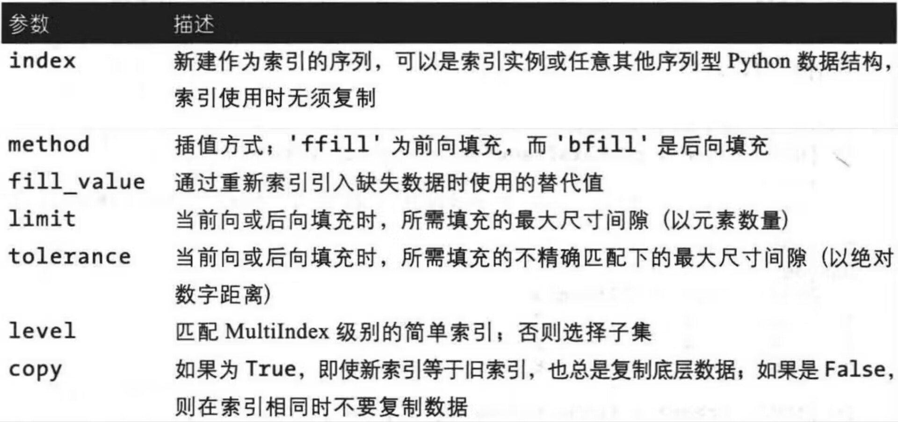
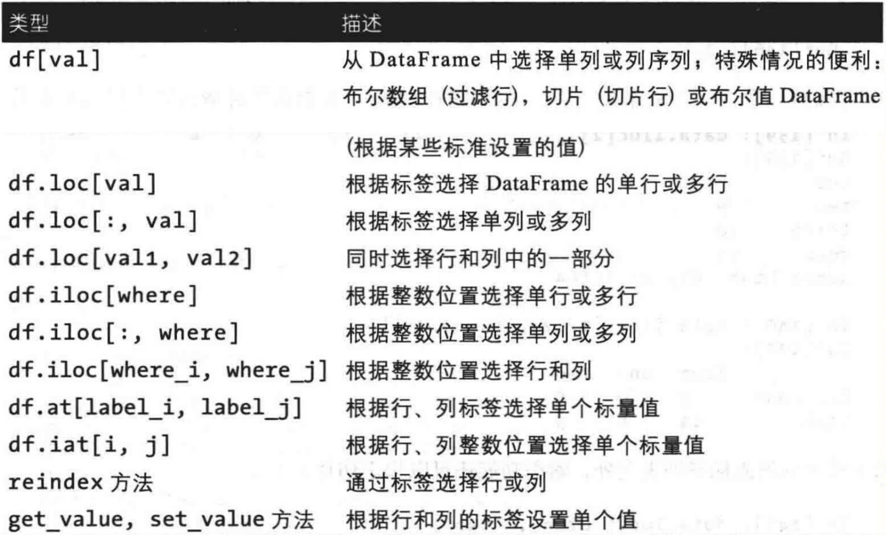
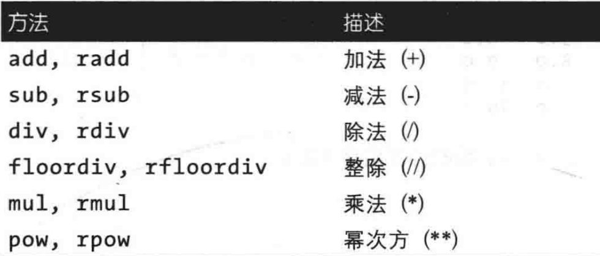
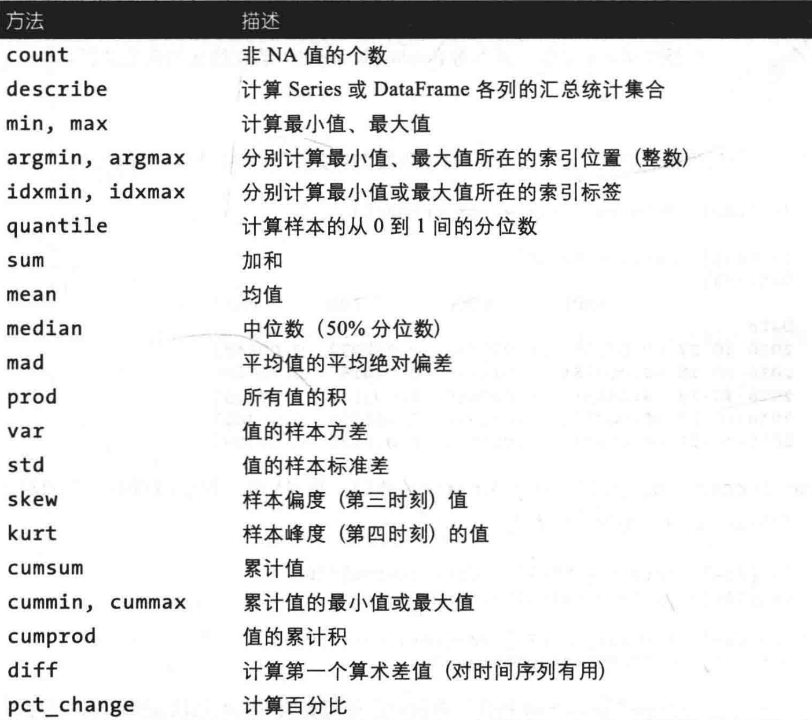

# 基本数据结构

两种基本的数据结构

**一维的 Series**  &  **二维的 DataFrame**

## Series

### 4个组成部分

1. data 序列的值  `.values`
2. index 索引 `.index`
3. dtype 存储类型 `.dtype`
4. name 序列名称 `.name`

### 创建方法

1. 数组 直接创建
2. 数组 + 索引
3. 字典创建
   可以通过自己想要的顺序传给构造函数，生成符合预期的Series索引

### 操作

1. `.`来获得属性
2. `.shape`来获得序列的长度
3. `[index_item]`来取出单个索引对应的值
4. `.to_dict`转为字典
5. `.isna()` `.notna()` 检测缺失数据

## DateFrame

### 5个组成部分

1. data 序列的值  `.values`
2. index 行索引 `.index`
3. columns 列索引 `.columns`
4. dtype 存储类型 `.dtype  # 返回的是值为相应列数据类型的Series`
5. name 序列名称 `.name` df本身并没 `name`属性，而是其 `index` `columns`对应Series具有

### 构造

1. 由二维的data与行列索引来构造
2. 从列索引名到数据的映射来构造，再加上行索引


### 操作

1. `.`取出相应的属性
2. `.T`进行转置
3. `df[col_name]`修改或新增一列，`df[col_list]`修改多列
4. `drop`删除某一行/列
5. `to_numpy()`将df以二维ndarray返回

## 索引对象

`Index`对象

1. 相关参数: class pandas.Index(data=None, dtype=None, copy=False, name=None, tupleize_cols=True)

* `data`任意数组（一维）或者Series和Dataframe的标签序列
* `dtype`若dtype为None，将会找到最适合数据的dtype；若提供了实际的dtype,在安全的前提下，会强制使用该dtype
* `copy`创建输入ndarray的副本
* `name`要存储在索引中的名称
* `tupleze_cols`默认为真，在可能的情况下创建多级索引

2. 一些索引对象的方法和属性
   

# 基本功能

## 重建索引

`.reindex`

1. 不同对象reindex方法的参数

* **Series.**reindex**(** *index*=*None* , *axis*=None ,  *method*=None ,  *copy**=None ,  *level*=None ,  *fill_value*=None ,  *limit*=None ,  *tolerance*=None)
* **DataFrame.**reindex**(** *labels*=*None* ,  **index**=None ,  columns=None ,  axis=None ,  method=None,  copy=None ,  level=None ,  fill_value=nan ,  limit=None,  tolerance=None)
* **Index.**reindex**(** *target* ,  *method*=**None* ,  *level**=None ,  limit=None,  tolerance=None)

2. 常见参数的解释

* dataframe.reindex中可以通过 `columns`或者 `axis`来对列进行重建索引
* `method`为插值方法，分为 `ffill`前向填充和 `bfill`后向填充
  ```python
  import pandas as pd
  obj = pd.Series(['a','b','c'],index=[0,2,4])
  print(obj)
  obj2 = obj.reindex(range(6),method = 'ffill')
  obj3 = obj.reindex(range(6),method = 'bfill')
  print(obj2)
  print(obj3)

  #输出结果为
  0    a
  2    b
  4    c
  dtype: object
  0    a
  1    a
  2    b
  3    b
  4    c
  5    c
  dtype: object
  0      a
  1      b
  2      b
  3      c
  4      c
  5    NaN
  dtype: object
  ```

## 删除指定轴上的项

`.drop()`

1. 函数参数

   drop(*labels*=**None* , *axis**=0 ,  index=None,  columns=None, level=None,  inplace=False ,  errors='raise')

* `labels`要删除的索引或列标签及其组成的列表
* `axis`默认为0，删除标签；设为1，则删除列
* `index`指定轴的替代方法，此时axis=0
* `columns`指定轴的替代方法，此时axis=1
* `level`对于多级索引，将删除标签中对应的层级
* `inplace`为True时，将会清除被删除的数据；为False时，将返回副本
* `errors`若设置为'ignore'，则禁止显示错误，并且删除现有标签；为'raise'，则正常显示错误

## 索引、选取和过滤

`loc` `iloc`：可以用于DataFrame在行上的标签索引

1. `loc`函数，允许常见的输入有：

* 单个标签
* 标签列表或数组
* 带有标签的切片对象，**值得注意的是 `loc`函数切片是，开始和停止的端点都包括**
* 与被切片轴长度相同的布尔数组
* 可对齐的布尔系列
* 可对齐的索引

2. `iloc`函数，主要基于标签的整数位置，也可以使用布尔值，允许的常见输入有：

* 一个整数
* 整数的列表或数组
* 带有整数的切片对象，`iloc`函数切片时，与python切片一致，不包括终点
* 布尔数组

3. DataFrame索引选项

   

## 算术运算和数据对齐

缺失值填充 `fill_value = `

广播机制

函数应用和映射



## 函数应用和映射

### `apply`函数：沿DataFrame的索引和列的应用函数

1. 函数参数apply(func, axis=0, raw=False, result_type=None, args=(), **kwargs)

* `func`应用于每一列或每一行的函数
* `axis`默认为0，则将函数应用于每列；为1，则将函数应用于每行
* `raw`默认为False,则将每一列或每一行作为Series对象传递给函数；为True，则将ndarray对象传递给函数
* `result_type`默认为None;若为'expand',类似列表的结果将变成列；若为'reduce'，可能的话返回一个Series对象，与'expand'相反；若为'broadcast'，结果将被广播到原始的DataFrame,原始的索引和列将被保留

### `applymap`函数：对DataFrame逐元素的应用函数

1. 函数参数applymap（func， na_action=None， ****kwargs)**

* `func`python函数，从单个值返回单个值
* `na_action`默认为None;若为'ignore',则传播NaN值，而不将它们传递给func

## 排序和排名

`sort_values` `sort_index`

### `sort_index`函数沿轴对对象进行排序

1. 函数参数sort_index(* ,  *axis*=**0* ,  *level**=None ,  *ascending*=True ,  *inplace*=False ,  *kind*='quicksort' ,  na_position='last' ,  sort_remaining=True ,  ignore_index=False ,  key=None)

* `axis`默认为0，标识行；为1，标识列
* `level`默认为None;不是None,则按指定索引级别的值排序

* `ascending`默认为真，升序排序；为假，降序排序
* `inplace`默认为假，对数据进行修改，创建并返回新的对象承载其修改结果；默认为真，不创建新的对象，直接对原始对象进行修改

* `kind`排序算法的选择，默认'quicksort'快速排序；若为'mergesort'，则为归并排序；若为'heapsort',则为堆排序
* `na_position`默认为'last'，将NaN放在最后；若为'first'，将NaN放在开头

* `sort_remaining`默认为真，若为真且按level和index排序是多级层级，在对指定层级排序后，其他层级也排序
* `ignore_index`默认为假；若为真，则生成的轴将标记为0~n-1

### `sort_values`函数

1. 函数参数sort_values(by, *, axis=0, ascending=True, inplace=False, kind='quicksort', na_position='last', ignore_index=False, key=None)

* `by`要作为排序依据的名称或名称列表。如果轴为 0 或“索引”，则 by 可能包含索引 级别和/或列标签。如果轴为 1 或“列”，则 by 可能包含列 级别和/或索引标签。
* 其他参数与 `sort_index`要求一致

### `rank()`函数

1. 函数参数rank(axis=0, method='average', numeric_only=False, na_option='keep', ascending=True, pct=False)

- `axis`默认为0，则对索引进行排名；为1，则对列进行排名
- `method`默认为'average'，在每个组中分配平均排名；若为'min'，对整个组使用最小排名；若为'max'，对整个组使用最大排名；若使用'first'，按照值在数据中出现的次序分配排名；若为'dense',类似于method='min',但组间排名总是增加1，而不是一个组中的相等元素的数量

* `numeric_only`默认值为False;若为True,则仅对数字列进行排名
* `na_option`对NaN值进行排名，默认为keep,则将NaN分配给NaN值；若为top,将最低排名分配给NaN值；若为bottom，则将最高排名分配给NaN值
* `ascending`默认值为真，升序排序；若为假，b降序排序
* `pct`是否以百分位数显示返回的排名形式

2. 平级关系打破方法

```python
import pandas as pd
obj = pd.Series([7, -5, 7, 4, 2, 0, 4])
obj1 = obj.rank()#默认为'average'
obj2 = obj.rank(method='first')
obj3 = obj.rank(method='max')
obj4 = obj.rank(method='min')
obj5 = obj.rank(method='dense')
print(obj1,obj2,obj3,obj4,obj4,obj5)

#输出结果
#obj1,average方法,排名相同的取平均值，例如Series中两个4排名为4和5，取4.5平均值
0    6.5
1    1.0
2    6.5
3    4.5
4    3.0
5    2.0
6    4.5
dtype: float64
#obj2，first方法，按照数据出现次序分配排名，例如索引为3和索引6的4，索引为3的排名为4，索引为6的排名为5
0    6.0
1    1.0
2    7.0
3    4.0
4    3.0
5    2.0
6    5.0
dtype: float64
#obj3，max方法，使用最大排名，Series中的两个4都用了5这个排名
0    7.0
1    1.0
2    7.0
3    5.0
4    3.0
5    2.0
6    5.0
dtype: float64
#obj4，min方法，使用最小排名，Series中的两个4都用了4这个排名
0    6.0
1    1.0
2    6.0
3    4.0
4    3.0
5    2.0
6    4.0
dtype: float64
#obj5，dense方法，类似min方法，两个4都为4排名，但组间排名总增加1，因此两个7都为5排名
0    5.0
1    1.0
2    5.0
3    4.0
4    3.0
5    2.0
6    4.0
dtype: float64
```

# 描述性统计汇总和计算

约简方法
累计型方法
汇总统计



## 相关系数与协方差

`corr` `cov` `corrwith`

`corr`函数

## 唯一值、计数及成员属性

`unique` `value_counts` `isin` `match`

### `unique`函数

返回Series中的唯一值，按出现的顺序返回，不排序

### `value_counts`函数

1. 函数参数value_counts( *subset*=**None* ,  *normalize**=False ,  *sort*=True ,  *ascending*=False, *dropna*=True)

* `subset`标签或者标签列表，计数唯一组合时使用的列
* `normalize`默认为假，返回比例而不是频率
* `sort`默认为真，按降序排序；若为假，按升序排序，排序依据为元素出现的频率
* `ascending`默认为假，按降序排序；若为真，按升序排序
* `dropna`默认为真，不计算包含NA值的行数

### `isin`函数

1. isin(values)，计算表征Series中每个值是否包含于传入序列的布尔值数组

* `values`可以为迭代器，Series,DataFrame和字典

### `match`函数

计算数组中每个值的整数索引，形成一个唯一值数组
