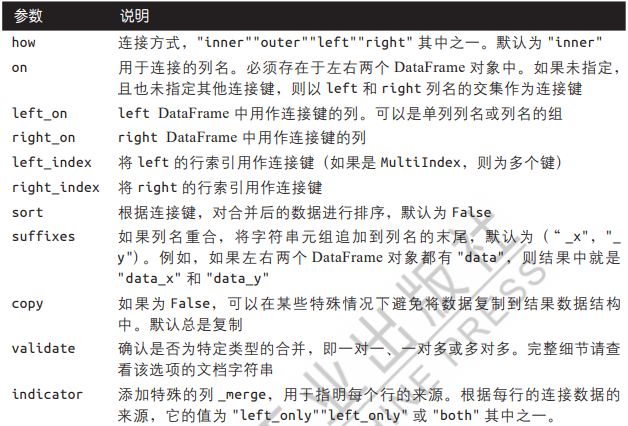

# 层次化索引

`MultiIndex`

```python
class pandas.MultiIndex(levels=None, codes=None, sortorder=None, names=None, dtype=None, copy=False, name=None, verify_integrity=True)
```

A multi-level, or hierarchical, index object for pandas objects.

Parameters

- **levels**sequence of arrays

  The unique labels for each level.

[pandas.MultiIndex — pandas 2.0.3 documentation (pydata.org)](https://pandas.pydata.org/pandas-docs/stable/reference/api/pandas.MultiIndex.html?highlight=multiindex#pandas.MultiIndex)

```python
DataFrame.stack(level=- 1, dropna=True)
```

Stack the prescribed level(s) from columns to index.

Parameters

- **level**int, str, list, default -1Level(s) to stack from the column axis onto the index axis, defined as one index or label, or a list of indices or labels.
- **dropna**bool, default True Whether to drop rows in the resulting Frame/Series with missing values. Stacking a column level onto the index axis can create combinations of index and column values that are missing from the original dataframe. See Examples section.

Returns

- DataFrame or SeriesStacked dataframe or series.

[pandas.DataFrame.stack — pandas 2.0.3 documentation (pydata.org)](https://pandas.pydata.org/pandas-docs/stable/reference/api/pandas.DataFrame.stack.html?highlight=stack#pandas.DataFrame.stack)

```python
DataFrame.unstack(level=- 1, fill_value=None)
```

Pivot a level of the (necessarily hierarchical) index labels.

Parameters

- **level**int, str, or list of these, default -1 (last level)

  Level(s) of index to unstack, can pass level name.
- **fill_value**int, str or dict

  Replace NaN with this value if the unstack produces missing values.

Returns

- Series or DataFrame

[pandas.DataFrame.unstack — pandas 2.0.3 documentation (pydata.org)](https://pandas.pydata.org/pandas-docs/stable/reference/api/pandas.DataFrame.unstack.html?highlight=stack#pandas.DataFrame.unstack)

`nlevels`  知道索引有多少层

## 重排序和层级索引

```python
DataFrame.swaplevel(i=- 2, j=- 1, axis=0)
```

Swap levels i and j in a [`MultiIndex`](https://pandas.pydata.org/pandas-docs/stable/reference/api/pandas.MultiIndex.html#pandas.MultiIndex).

Parameters

- **i, j** int or str

  Levels of the indices to be swapped. Can pass level name as string.
  <<<<<<< HEAD
- **axis**, default 0
  ===============
- **axis** {0 or ‘index’, 1 or ‘columns’}, default 0

  The axis to swap levels on. 0 or ‘index’ for row-wise, 1 or ‘columns’ for column-wise.

Returns

- DataFrame

  DataFrame with levels swapped in MultiIndex.

[pandas.DataFrame.swaplevel — pandas 2.0.3 documentation (pydata.org)](https://pandas.pydata.org/pandas-docs/stable/reference/api/pandas.DataFrame.swaplevel.html?highlight=swaplevel#pandas.DataFrame.swaplevel)

```python
DataFrame.sort_index(*, axis=0, level=None, ascending=True, inplace=False, kind='quicksort', na_position='last', sort_remaining=True, ignore_index=False, key=None)
```

Sort object by labels (along an axis).

Parameters

- **axis**{0 or ‘index’, 1 or ‘columns’}, default 0

  The axis along which to sort. The value 0 identifies the rows, and 1 identifies the columns.
- **level**int or level name or list of ints or list of level names

  If not None, sort on values in specified index level(s).
- **ascending**bool or list-like of bools, default True

  Sort ascending vs. descending. When the index is a MultiIndex the sort direction can be controlled for each level individually.

Returns

- DataFrame or None

  The original DataFrame sorted by the labels or None if `inplace=True`.

[pandas.DataFrame.sort_index — pandas 2.0.3 documentation (pydata.org)](https://pandas.pydata.org/pandas-docs/stable/reference/api/pandas.DataFrame.sort_index.html?highlight=sort_index)

## 按层级进行汇总统计

```python
DataFrame.groupby(by=None, axis=0, level=None, as_index=True, sort=True, group_keys=True, observed=False, dropna=True)
```

Group DataFrame using a mapper or by a Series of columns.

Parameters

- **by**mapping, function, label, pd.Grouper or list of such

  Used to determine the groups for the groupby. If `by` is a function, it’s called on each value of the object’s index. If a dict or Series is passed, the Series or dict VALUES will be used to determine the groups (the Series’ values are first aligned; see `.align()` method). If a list or ndarray of length equal to the selected axis is passed (see the [groupby user guide](https://pandas.pydata.org/pandas-docs/stable/user_guide/groupby.html#splitting-an-object-into-groups)), the values are used as-is to determine the groups. A label or list of labels may be passed to group by the columns in `self`. Notice that a tuple is interpreted as a (single) key.

Returns

- DataFrameGroupBy

  Returns a groupby object that contains information about the groups.

## 使用DataFrame的列进行索引

```python
DataFrame.set_index(keys, *, drop=True, append=False, inplace=False, verify_integrity=False)
```

Set the DataFrame index using existing columns.

Parameters

- **keys**label or array-like or list of labels/arrays

  This parameter can be either a single column key, a single array of the same length as the calling DataFrame, or a list containing an arbitrary combination of column keys and arrays. Here, “array” encompasses [`Series`](https://pandas.pydata.org/pandas-docs/stable/reference/api/pandas.Series.html#pandas.Series), [`Index`](https://pandas.pydata.org/pandas-docs/stable/reference/api/pandas.Index.html#pandas.Index), `np.ndarray`, and instances of [`Iterator`](https://docs.python.org/3/library/collections.abc.html#collections.abc.Iterator).
- **drop**bool, default True

  Delete columns to be used as the new index.

Returns

- DataFrame or None

  Changed row labels or None if `inplace=True`.

[pandas.DataFrame.set_index — pandas 2.0.3 documentation (pydata.org)](https://pandas.pydata.org/pandas-docs/stable/reference/api/pandas.DataFrame.set_index.html?highlight=set_index)

```python
DataFrame.reset_index(level=None, *, drop=False, inplace=False, col_level=0, col_fill='', allow_duplicates=_NoDefault.no_default, names=None)
```

Reset the index, or a level of it.

Parameters

- **level**int, str, tuple, or list, default None

  Only remove the given levels from the index. Removes all levels by default.
- **drop**bool, default False

  Do not try to insert index into dataframe columns. This resets the index to the default integer index.

Returns

- DataFrame or None

  DataFrame with the new index or None if `inplace=True`.

# 联合与合并数据集

## 数据库风格的DataFrame连接

### `merge`函数

[pandas.merge — pandas 2.0.3 documentation (pydata.org)](https://pandas.pydata.org/docs/reference/api/pandas.merge.html?highlight=merge#pandas.merge)

1. 函数参数

```python
pandas.merge(left, right, how='inner', on=None, left_on=None, right_on=None, left_index=False, right_index=False, sort=False, suffixes=('_x', '_y'), copy=None, indicator=False, validate=None)
```



2. 关于 `how`参数

```python

import pandas as pd
df1 = pd.DataFrame({'key':['b','b','a','c','a','a','b'],
                   'data1':range(7)})
df2 = pd.DataFrame({'key':['a','b','d'],
                    'data2':range(3)})
df3 = pd.merge(df1,df2)
df4 = pd.merge(df1,df2,how = 'outer')
df5 = pd.merge(df1,df2,how = 'left')
df6 = pd.merge(df1,df2,how = 'right')
df7 = pd.merge(df1,df2,how = 'cross')
```

```python
#输出结果
#df1
  key  data1
0   b      0
1   b      1
2   a      2
3   c      3
4   a      4
5   a      5
6   b      6

#df2
  key  data2
0   a      0
1   b      1
2   d      2

#df3，默认为inner,类似交集，df1与df2相同的key列中有a,b两个相同元素，df3中key中为3个a和3个b,其结果由df1与df2中a,b的笛卡尔积得出；df1中有三个b行，df2中只有一个b行，由此df3中有3个b行；a行同理
  key  data1  data2
0   b      0      1
1   b      1      1
2   b      6      1
3   a      2      0
4   a      4      0
5   a      5      0

#df4，how设置为outer，类似并集，df4中除了有df1与df2 a,b行的笛卡尔积外，还有df1中的c行，df2中的d行
  key  data1  data2
0   b    0.0    1.0
1   b    1.0    1.0
2   b    6.0    1.0
3   a    2.0    0.0
4   a    4.0    0.0
5   a    5.0    0.0
6   c    3.0    NaN
7   d    NaN    2.0

#df5，how设置为left，以左表的键进行联合，因此df5中只含有df1中的元素，由共有的a,b笛卡尔积与df1中的c行组成
  key  data1  data2
0   b      0    1.0
1   b      1    1.0
2   a      2    0.0
3   c      3    NaN
4   a      4    0.0
5   a      5    0.0
6   b      6    1.0

#df6，how设置为right,以右表的键进行联合，因此df6中只含有df2中的元素
  key  data1  data2
0   a    2.0      0
1   a    4.0      0
2   a    5.0      0
3   b    0.0      1
4   b    1.0      1
5   b    6.0      1
6   d    NaN      2

#df7，how设置为cross，结果为两个key列的所有元素的笛卡尔积，并以左表的键为顺序
   key_x  data1 key_y  data2
0      b      0     a      0
1      b      0     b      1
2      b      0     d      2
3      b      1     a      0
4      b      1     b      1
5      b      1     d      2
6      a      2     a      0
7      a      2     b      1
8      a      2     d      2
9      c      3     a      0
10     c      3     b      1
11     c      3     d      2
12     a      4     a      0
13     a      4     b      1
14     a      4     d      2
15     a      5     a      0
16     a      5     b      1
17     a      5     d      2
18     b      6     a      0
19     b      6     b      1
20     b      6     d      2
```

## 根据索引合并

1. 用 `left_index`与 `right_index`两个参数

单层索引的情况与按列连接的机理一样，但多层索引有所区别

```python
left = pd.DataFrame({'key1':['a','a','a','b','b'],'key2':[1,2,3,2,3],'data':np.arange(5.)})
right = pd.DataFrame(np.arange(12).reshape((6,2)),index=[['b','b','a','a','a','a'],[1,1,1,1,2,3]],columns=['event1','event2'])
pd.merge(left,right,left_on=['key1','key2'],right_index=True)
```

```python
  #left输出
  key1  key2  data
0    a     1   0.0
1    a     2   1.0
2    a     3   2.0
3    b     2   3.0
4    b     3   4.0

#right输出
     event1  event2
b 1       0       1
  1       2       3
a 1       4       5
  1       6       7
  2       8       9
  3      10      11

#连接后的结果为
  key1  key2  data  event1  event2
0    a     1   0.0       4       5
0    a     1   0.0       6       7
1    a     2   1.0       8       9
2    a     3   2.0      10      11

#多层索引要将外层索引与内层索引看作对应为一个一个的元组，例如right中分别为(b,1),(b,1),(a,1),(a,1),(a,2),(a,3)六个元组
#因此相对的left_on的列也要对应为元组，接下来的操作与一般情况类似
#根据how参数的设置，共有的元组进行笛卡尔积，产生最终的结果
```

2. `join`函数也可用于根据索引合并

   [pandas.DataFrame.join — pandas 2.0.3 documentation (pydata.org)](https://pandas.pydata.org/docs/reference/api/pandas.DataFrame.join.html?highlight=join#pandas.DataFrame.join)

   函数参数

```python
DataFrame.join(other, on=None, how='left', lsuffix='', rsuffix='', sort=False, validate=None)
```

- `other`DataFrame, Series, 或者包含它们任意组合的列表
- `on`需要的列名，必须是在两边的DataFrame对象都有的列名
- `how`可选参数{'left', 'right', 'outer', 'inner' ,'cross'},与 `merge`方法不同，`join`的 `how`参数默认为 `left`
- `luffix`给左DataFrame中重叠列使用的后缀
- `rsuffix`给右DataFrame中重叠列使用的后缀
- `sort`按连接键按字母顺序对结果DataFrame进行排序。默认为假，连接键的顺序则取决于 `how`参数的类型
- `validate`检查连接是否为指定类型

## 轴向拼接

### `concat`函数

[pandas.concat — pandas 2.0.3 documentation (pydata.org)](https://pandas.pydata.org/docs/reference/api/pandas.concat.html?highlight=concat#pandas.concat)

1. 函数参数

```python
pandas.concat(objs, *, axis=0, join='outer', ignore_index=False, keys=None, levels=None, names=None, verify_integrity=False, sort=False, copy=None)
```

- `objs`需要连接的pandas对象列表或字典；这是必选参数
- `axis`连接的轴向；默认为0（沿行方向)。若连接的对象为多个Series，沿0轴方向则结果为一个Series对象；若为1，结果则为一个DataFrame对象
- `join`可选参数{'inner', 'outer'}，默认为'outer'
- `ignore_index`默认为假；若为真，则不沿着连接轴保留索引，而产生一段新的索引，标记为0、1、2、...... 、n-1
- `keys`与要连接的对象关联的值，沿着连接轴形成分层索引。可以是任意值的列表或数组、元组的数组、数组的列表。
- `levels`在键值传递时，该参数用于指定多层索引的层级
- `names`若传入了 `keys`或 `levels`参数，该参数用于多层索引的层级名称
- `verify_integrity`检查连接对象中的新轴是否重复；默认为假，允许重复，若为真，重复则引发异常
- `sort`对非串联轴进行排序，默认为假
- `copy`默认为真；若设置为假，则不复制数据

## 联合重叠数据

### `combine_first`函数

[pandas.DataFrame.combine_first — pandas 2.0.3 documentation (pydata.org)](https://pandas.pydata.org/docs/reference/api/pandas.DataFrame.combine_first.html?highlight=combine_first#pandas.DataFrame.combine_first)

1. 函数参数

```python
Series.combine_first(other)
DataFrame.combine_first(other)
```

`combine_first`可以理解为根据传入的对象来“修补”调用对象的缺失值

# 重塑与透视

## 使用层次化索引进行重塑

### `stack`函数

[pandas.DataFrame.stack — pandas 2.0.3 documentation (pydata.org)](https://pandas.pydata.org/docs/reference/api/pandas.DataFrame.stack.html?highlight=stack#pandas.DataFrame.stack)

将列中的数据透视到行

1. 函数参数

```python
DataFrame.stack(level=- 1, dropna=True)
```

- `level`从列堆叠到索引的层级，默认为-1
- `dropna`是否删除缺失值，默认为真

### `unstack`函数

[pandas.DataFrame.unstack — pandas 2.0.3 documentation (pydata.org)](https://pandas.pydata.org/docs/reference/api/pandas.DataFrame.unstack.html?highlight=unstack#pandas.DataFrame.unstack)

将行中的数据透视到列

1. 函数参数

```python
DataFrame.unstack(level=- 1, fill_value=None)
```

- `level`要拆堆的索引的级别，默认为-1
- `fill_value`如果要拆堆，替换缺失值的值

## 将长格式透视为宽格式

### `pivot`函数

[pandas.pivot — pandas 2.0.3 documentation (pydata.org)](https://pandas.pydata.org/docs/reference/api/pandas.pivot.html?highlight=pivot#pandas.pivot)

1. 函数参数

```python
pandas.pivot(data, *, columns, index=typing.Literal[<no_default>], values=typing.Literal[<no_default>])
```

- `data`DataFrame对象
- `columns`用于创建新frame的列
- `index`用于创建新frame的索引
- `values`用于填充新frame值的列

## 将宽格式透视为长格式

### `melt`函数

[pandas.melt — pandas 2.0.3 documentation (pydata.org)](https://pandas.pydata.org/docs/reference/api/pandas.melt.html?highlight=melt#pandas.melt)

1. 函数参数

```python
pandas.melt(frame, id_vars=None, value_vars=None, var_name=None, value_name='value', col_level=None, ignore_index=True)
```

- `id_vars`用作标识符变量的列，可以时元组、列表或者ndarray
- `value_vars`要取消透视的列。如果未指定，则使用所有未设置为 `id_vars`的列
- `var_name`用于变量列的名称
- `value_name`用于值列的名称
- `col_level`如果列是多索引，则使用此级别进行melt
- `ignore_index`如果为 True，则忽略原始索引。如果为 False，则保留原始索引。 索引标签将根据需要重复
